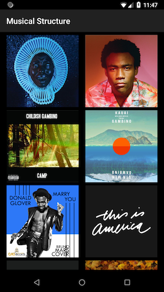

# Musical Structure

# About the app

- Built and tested on Nexus 5 API 25
- Images of all albums added and used as links to the songs in the albums
- Song class implemented to instantiate song objects
- Intents used to access songs list from album covers
- Navigation implemented
- ArrayList use to create songs object
- ArrayAdapter overridden to create a SongAdapter

# Views

